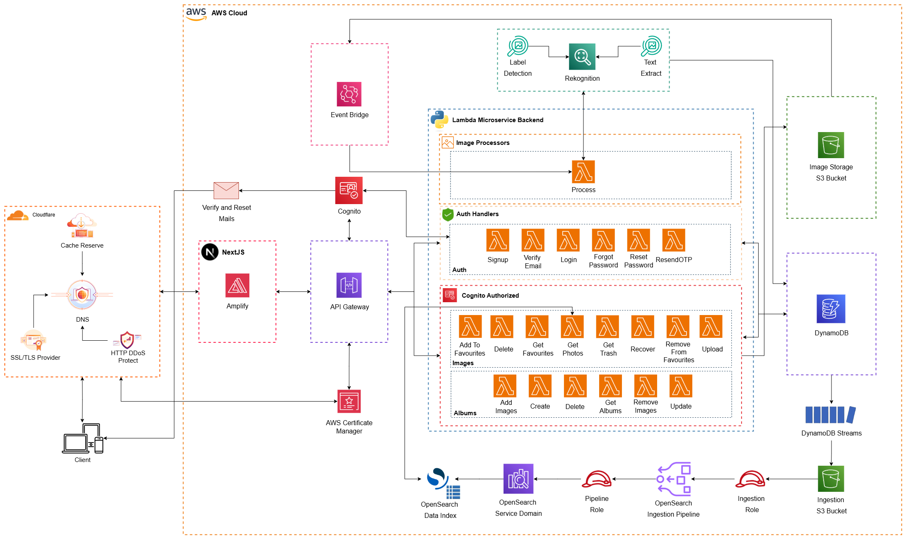

Project

<div align="center">
  
</div>

This repository hosts the frontend and backend components of the CSC Project. The frontend is developed using [Next.js](https://nextjs.org) and styled with [Tailwind CSS](https://tailwindcss.com). The backend leverages AWS Lambda for serverless operations and includes a data ingestion pipeline configuration.

## Features

### Frontend
- **User Authentication**: Supports login, signup, and password recovery.
- **Photo Management**: Enables uploading, organizing, and deleting photos.
- **Albums**: Allows creating, editing, and deleting albums.
- **Favorites**: Lets users mark photos as favorites for quick access.
- **Trash**: Provides options to recover or permanently delete photos.
- **Responsive Design**: Optimized for both desktop and mobile devices.

### Backend
- **AWS Lambda Functions**:
  - **Albums**:
    - Manage albums: create, update, delete, and fetch.
    - Add or remove images from albums.
  - **Images**:
    - Handle image uploads, deletions, recovery, and favorites.
    - Use AWS Rekognition for label detection and text extraction.
  - **Authentication**:
    - User signup integrated with AWS Cognito and DynamoDB.
- **Data Pipeline**:
  - Configures a DynamoDB to OpenSearch pipeline for event data ingestion.

## Getting Started

### Prerequisites

- Node.js (v16 or later)
- A package manager like npm, yarn, or pnpm
- AWS CLI configured with the necessary permissions

### Installation

1. Clone the repository:
   ```bash
   git clone https://github.com/your-repo/csc-project.git
   cd csc-project
   ```

2. Navigate to the frontend directory and install dependencies:
   ```bash
   cd frontend
   npm install
   ```

3. Deploy the backend Lambda functions using AWS CLI or your preferred deployment tool.

### Running the Frontend Development Server

Start the development server:
```bash
npm run dev
```

Visit [http://localhost:3000](http://localhost:3000) in your browser to view the application.

### Deploying the Backend

1. Package and deploy the Lambda functions:
   ```bash
   zip -r function.zip .
   aws lambda update-function-code --function-name <function-name> --zip-file fileb://function.zip
   ```

2. Update and deploy the pipeline configuration in `pipeline-configuration.yaml`.

## Folder Structure

```
CSC-Project/
├── frontend/               # Frontend application
│   ├── src/                # Source code
│   ├── public/             # Static assets
│   ├── next.config.js      # Next.js configuration
│   ├── tailwind.config.js  # Tailwind CSS configuration
│   └── README.md           # Frontend documentation
├── lambda_sources/         # AWS Lambda functions
│   ├── CSC-Project-Albums-Create.py
│   ├── CSC-Project-Albums-Delete.py
│   ├── CSC-Project-Albums-GetAlbums.py
│   ├── CSC-Project-Albums-Update.py
│   ├── CSC-Project-Images-Upload.py
│   ├── CSC-Project-Images-Delete.py
│   ├── CSC-Project-Images-Recover.py
│   ├── CSC-Project-Images-GetTrash.py
│   ├── CSC-Project-Images-GetFavourites.py
│   ├── CSC-Project-Auth-Signup.py
│   └── CSC-Project-Image-Processor.py
├── pipeline-configuration.yaml  # DynamoDB to OpenSearch pipeline configuration
└── README.md               # Project documentation
```

## Environment Variables

### Frontend
Create a `.env.local` file in the `frontend` directory:
```env
NEXT_PUBLIC_API_URL=https://api.example.com
NEXT_PUBLIC_S3_BUCKET_URL=https://your-s3-bucket-url
```

### Backend
Set the following environment variables for Lambda functions:
```env
AWS_COGNITO_USER_POOL_ID=<your-user-pool-id>
AWS_COGNITO_CLIENT_ID=<your-client-id>
AWS_COGNITO_REGION=<your-region>
AWS_COGNITO_CLIENT_SECRET=<your-client-secret>
```

## Deployment

### Frontend
Deploy the frontend using [Vercel](https://vercel.com) or any other Next.js-compatible platform.

### Backend
Deploy the Lambda functions and pipeline configuration using AWS CLI or a CI/CD pipeline.

## Contributing

Contributions are welcome! Fork the repository and submit a pull request.

## License

This project is licensed under the MIT License. See the `LICENSE` file for details.

## Project Architecture

The CSC Project architecture leverages AWS services for scalability, security, and performance.

### Key Components

1. **Frontend**:
   - Built with Next.js and hosted on Amplify.
   - Integrated with AWS Cognito for authentication.
   - Uses Cloudflare for DNS, caching, and DDoS protection.

2. **Backend**:
   - Serverless architecture using AWS Lambda functions.
   - API Gateway for routing requests.
   - AWS Rekognition for image processing (label detection and text extraction).
   - DynamoDB for data storage and DynamoDB Streams for event-driven processing.

3. **Data Pipeline**:
   - DynamoDB to OpenSearch pipeline for indexing and search capabilities.

4. **Storage**:
   - S3 bucket for image storage.

5. **Security**:
   - AWS Certificate Manager for SSL/TLS.
   - Cloudflare for additional security layers.
